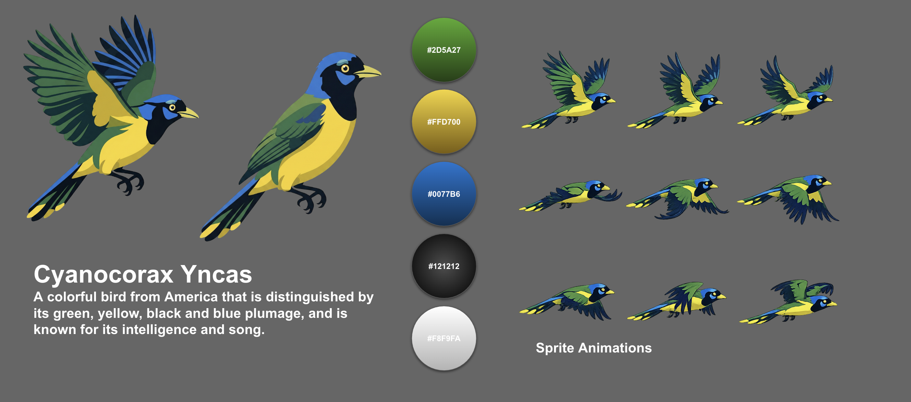
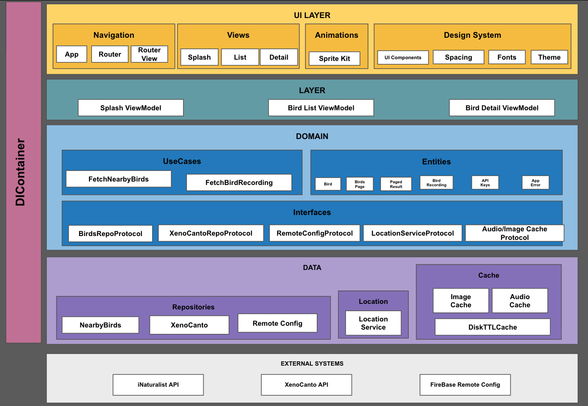

# Native Birds (iOS) — SwiftUI + Clean Architecture

**Native Birds** is an iOS app that discovers **nearby birds** using the device’s **current GPS location**, displays them in a **SwiftUI** experience, and lets users **listen to bird recordings**. The project follows **Clean Architecture / Clean Code** with a clear separation of UI, Presentation, Domain, Data, and External Systems. 

---

## Design Proposal (UI)

<table width="100%">
  <tr>
    <th width="65%">Design Proposal</th>
    <th width="35%">UI Animation</th>
  </tr>
  <tr>
    <td>
      
    </td>
    <td align="center">
      
    </td>
  </tr>
</table>

---

## Architecture Diagram

> 

---

## Architecture Overview (Clean Architecture)

The app is structured in layers:

- **UI Layer (SwiftUI)**
  - Navigation: `AppRouter`, `AppRouterView`
  - Views: `SplashView`, `BirdsListView`, `BirdDetailView`
  - Animations: **SpriteKit** (see “Animations” below)
  - Design System: spacing, typography, theme, reusable UI components

- **Presentation Layer**
  - ViewModels (`SplashViewModel`, `BirdsListViewModel`, `BirdDetailViewModel`) injected via `DIContainer` 

- **Domain Layer**
  - Use Cases:
    - `FetchNearbyBirdsUseCase`
    - `FetchBirdRecordingUseCase` :contentReference[oaicite:3]{index=3}
  - Entities:
    - `Bird`, `BirdRecording`, `PagedResult`, `BirdsPage`
  - Interfaces (Protocols):
    - `BirdsRepositoryProtocol`, `XenoCantoRepositoryProtocol`, `RemoteConfigProtocol`, `LocationServiceProtocol`, `cache protocols` 

- **Data Layer**
  - Repositories:
    - iNaturalist: `BirdsRepository`
    - Xeno-canto: `XenoCantoRepository`
    - Remote Config: `RemoteConfigRepository`  
  - Infrastructure:
    - Network: `URLSessionNetworkClient`
    - Cache: `DiskTTLCache`, `BirdImageCache`, `BirdAudioCache`  
    - Audio download: `AudioDownloadService`  

- **External Systems**
  - **iNaturalist API** for nearby observations (birds + photos)  
  - **Xeno-canto API** for top bird recordings   

- **API Keys**
  - **Firebase Remote Config** to securely fetch API keys at runtime  

---

## Key Features

### 1) Nearby birds using GPS current location
The app requests location permission and retrieves the **current coordinates** using `CoreLocation` via `LocationService`.

### 2) API keys from Firebase Remote Config
API keys are not hardcoded. They are fetched from **Firebase Remote Config** and cached in memory inside `RemoteConfigRepository`.

Remote Config keys used:
- `inat_bearer_token`
- `xeno_canto_key` 

### 3) 15-day cache for images and audio
The app caches both images and audio on disk with a **TTL of 15 days**:
- `BirdImageCache` 
- `BirdAudioCache`

### 4) SpriteKit animations (bird flight)
For rich loading / placeholder experiences, the app uses **SpriteKit** with a sprite sheet:
- `BirdFlightScene` + `BirdFlightView`
- Loaded via `SpriteView` in SwiftUI

### 5) Design System implemented
Centralized tokens for:
- Colors (`BirdTheme`)
- Typography (`BirdTypography`)
- Spacing (`BirdSpacing`)
- Reusable components (`BirdButton`, `BirdLabel`, etc.)

---

## Data Flow (High-level)

1. **Splash**
   - Firebase is configured at app start (`FirebaseApp.configure()`).
   - Remote Config activates to fetch keys.

2. **Bird List**
   - Location permission is requested; current coordinates are retrieved.
   - `FetchNearbyBirdsUseCase` calls `BirdsRepository` (iNaturalist). 

3. **Bird Detail**
   - `FetchBirdRecordingUseCase` normalizes scientific name to **genus + species** and calls Xeno-canto.
   - Audio is downloaded (if needed) and cached; playback uses `AVPlayer`. 

---

## Project Setup

### Requirements
- Xcode
- iOS 16+ 
- Location Permissions
- Firebase (Core + Remote Config)

---

## Testing & Quality

- **Architecture:** Clean Architecture with protocol-driven boundaries (testable use cases / repositories).
- **Coverage:** 70% (project target / current status to be maintained and improved).

